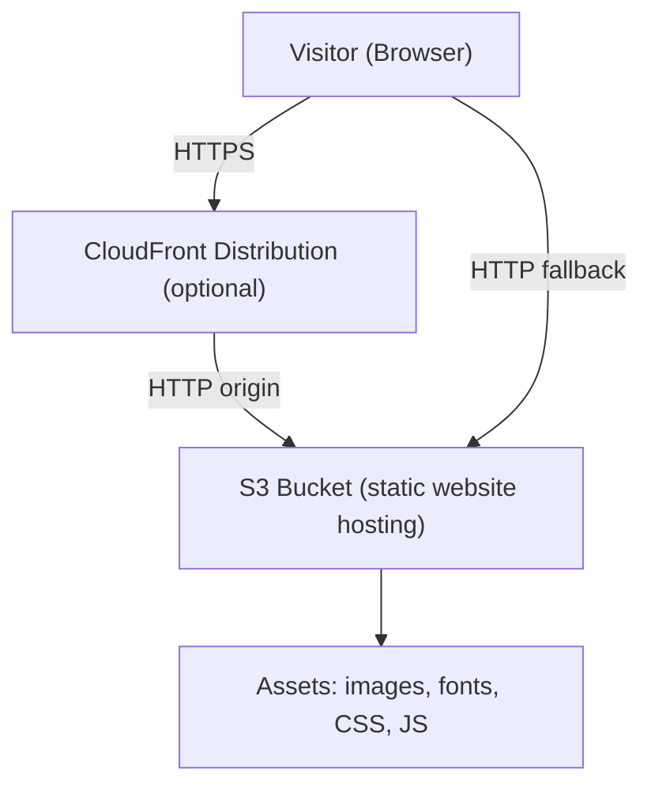

# Design Document: Adenine Research Website

## Overview

The Adenine Research website is a static multi-page site hosted on AWS S3, representing Adenine Research (Pty) Ltd. — a Computational Neuroscience company based in Africa researching optical fiber cochlear implants. The site targets scientists, collaborators, investors, and the broader scientific community.

The site is built with plain HTML, CSS, and vanilla JavaScript (no framework dependencies), keeping the deployment artifact simple: a directory of static files uploaded to an S3 bucket with static website hosting enabled. An optional CloudFront distribution sits in front for HTTPS, caching, and custom error pages.

### Technology Choices

- HTML5 / CSS3 / Vanilla JS — zero build-time framework dependency, maximum portability
- CSS custom properties for theming and consistent branding
- A lightweight CSS reset + utility layer (hand-written, no external framework) to keep bundle size minimal
- Optional: a single-file build script (Node.js or shell) to minify CSS/JS and optimise images for production
- Hosting: AWS S3 static website hosting + CloudFront (optional but recommended for HTTPS and caching)

---

## Architecture



### File Layout

```
/
├── index.html          # Home
├── about.html          # About
├── research.html       # Research
├── team.html           # Team
├── contact.html        # Contact
├── error.html          # 4xx error page
├── css/
│   ├── reset.css
│   ├── variables.css   # CSS custom properties (colors, typography)
│   └── main.css        # All page styles
├── js/
│   ├── nav.js          # Mobile hamburger toggle + active-link logic
│   └── contact.js      # Contact form validation + submission feedback
└── assets/
    ├── logo.svg        # Wordmark / logo
    ├── hero.webp       # Hero background image
    ├── team/           # Team member photos (WebP)
    └── research/       # Research diagrams / illustrations (WebP/SVG)
```

### Deployment

1. Build step: minify `css/main.css` → `css/main.min.css`, minify `js/*.js` → `js/*.min.js`, optimise images to WebP.
2. Upload all files to the S3 bucket.
3. S3 bucket policy: public read on all objects.
4. S3 website configuration: index document = `index.html`, error document = `error.html`.
5. (Optional) CloudFront distribution pointing at the S3 website endpoint with cache-control headers set per content type.

---

## Components and Interfaces

### Shared Layout Shell

Every HTML page shares the same structural shell:

```html
<header>
  <nav id="site-nav" aria-label="Site navigation">
    <a href="/" class="nav-logo">Adenine Research</a>
    <button id="nav-toggle" aria-expanded="false" aria-controls="nav-links">Menu</button>
    <ul id="nav-links" role="list">
      <li><a href="/index.html">Home</a></li>
      <li><a href="/about.html">About</a></li>
      <li><a href="/research.html">Research</a></li>
      <li><a href="/team.html">Team</a></li>
      <li><a href="/contact.html">Contact</a></li>
    </ul>
  </nav>
</header>
<main><!-- page-specific content --></main>
<footer><!-- company info, copyright --></footer>
```

Active-link highlighting is applied by `nav.js` by comparing `window.location.pathname` against each link's `href` and adding an `aria-current="page"` attribute plus a CSS `.active` class.

### nav.js

Responsibilities:
- On DOMContentLoaded, mark the current page's nav link as active (`aria-current="page"`, class `active`).
- Toggle the mobile menu open/closed when `#nav-toggle` is clicked, updating `aria-expanded`.
- Close the mobile menu when focus leaves the nav or Escape is pressed.

Interface (no exports — runs as a side-effect script):
```
initNav() → void
```

### contact.js

Responsibilities:
- Intercept the form's `submit` event.
- Validate: all required fields non-empty, email field matches RFC 5322 simplified regex.
- On validation failure: display inline error messages adjacent to each invalid field; prevent submission.
- On validation success: since this is a static site with no backend, show a visual confirmation message (the form is hidden, a success banner is shown). Integration with a third-party form service (e.g., Formspree, Netlify Forms) is handled by setting the form `action` attribute — the JS only handles client-side validation and the success UI state.

Interface:
```
initContactForm(formSelector: string) → void
validateEmail(email: string) → boolean
validateField(field: HTMLInputElement | HTMLTextAreaElement) → { valid: boolean, message: string }
```

### Pages

| Page | File | Key Sections |
|---|---|---|
| Home | `index.html` | Hero (tagline + CTA), Summary, Visual |
| About | `about.html` | Mission, Origins, Legal identity |
| Research | `research.html` | Optical fiber rationale, Comp. Neuro methods, Patient benefits, References |
| Team | `team.html` | Member cards (photo, name, role, bio, profile link) |
| Contact | `contact.html` | Company info, Contact form |
| Error | `error.html` | Friendly 404/error message, link back to Home |

---

## Data Models

Because this is a static site, there is no runtime database. Content is authored directly in HTML. The following logical models describe the structured content:

### TeamMember

```
TeamMember {
  name:        string        // Full name
  role:        string        // Job title / role
  bio:         string        // 2–4 sentence biography
  photoSrc:    string        // Path to WebP image or placeholder SVG
  photoAlt:    string        // Descriptive alt text
  profileUrl?: string        // Optional external profile URL (LinkedIn, etc.)
}
```

### Publication

```
Publication {
  authors:   string[]   // Author list
  title:     string     // Paper title
  venue:     string     // Journal or conference name
  year:      number     // Publication year
  url?:      string     // Optional DOI or link
}
```

### ContactFormData

```
ContactFormData {
  name:     string   // Visitor's full name (required)
  email:    string   // Visitor's email address (required, validated format)
  subject:  string   // Message subject (required)
  message:  string   // Message body (required)
}
```

### BrandTokens (CSS custom properties)

```
--color-primary:       #1a3a5c   // Deep navy — scientific authority
--color-accent:        #00a896   // Teal — innovation, life sciences
--color-background:    #f8f9fa   // Off-white
--color-surface:       #ffffff
--color-text:          #1c1c1e   // Near-black body text
--color-text-muted:    #6b7280
--font-heading:        'Inter', sans-serif
--font-body:           'Inter', sans-serif
--font-size-base:      1rem      // 16px
--font-size-lg:        1.25rem
--font-size-xl:        1.5rem
--font-size-2xl:       2rem
--font-size-3xl:       2.75rem
```

Contrast ratios (text on background):
- `--color-text` (#1c1c1e) on `--color-background` (#f8f9fa): ~18:1 ✓
- `--color-primary` (#1a3a5c) on `--color-background` (#f8f9fa): ~10:1 ✓
- `--color-accent` (#00a896) on `--color-surface` (#ffffff): ~3.8:1 — accent is used for decorative elements and large headings only; body text uses `--color-text`.

---


## Correctness Properties

*A property is a characteristic or behavior that should hold true across all valid executions of a system — essentially, a formal statement about what the system should do. Properties serve as the bridge between human-readable specifications and machine-verifiable correctness guarantees.*

### Property 1: Navigation structure is complete on every page

*For any* HTML page file in the site, the document must contain a `<nav>` element that includes links to all five required pages: Home, About, Research, Team, and Contact.

**Validates: Requirements 2.1, 2.2**

---

### Property 2: Active navigation link matches current page

*For any* page pathname passed to the `initNav` active-link logic, exactly one navigation link should receive `aria-current="page"` and the `.active` class, and that link's `href` must correspond to the current page.

**Validates: Requirements 2.4**

---

### Property 3: Team member cards are structurally complete

*For any* team member card rendered in `team.html`, the card must contain a non-empty name element, a non-empty role element, a non-empty biography element, and an `` element with a non-empty `alt` attribute.

**Validates: Requirements 6.2, 6.3**

---

### Property 4: Valid contact form submission produces success state

*For any* `ContactFormData` where all four fields (name, email, subject, message) are non-empty and the email is validly formatted, calling the form submission handler must result in the success confirmation UI being shown and the form being hidden.

**Validates: Requirements 7.5**

---

### Property 5: Invalid contact form submission produces inline errors

*For any* form submission attempt where at least one required field is empty or the email field is malformed, the submission handler must prevent submission and display at least one inline validation error message.

**Validates: Requirements 7.6**

---

### Property 6: Email validation accepts valid addresses and rejects invalid ones

*For any* string input to `validateEmail`, the function must return `true` if and only if the string matches a valid email address format (contains exactly one `@`, a non-empty local part, and a non-empty domain with at least one `.`).

**Validates: Requirements 7.7**

---

### Property 7: Mobile navigation toggle updates ARIA state

*For any* initial state of the mobile navigation (open or closed), toggling the `#nav-toggle` button must flip `aria-expanded` to the opposite value and correspondingly show or hide the `#nav-links` element.

**Validates: Requirements 8.3**

---

### Property 8: All non-decorative images have non-empty alt text

*For any* `` element across all HTML pages that does not have `alt=""` (i.e., is not explicitly marked decorative), the `alt` attribute must be present and non-empty.

**Validates: Requirements 10.1**

---

### Property 9: Every page uses semantic structural elements

*For any* HTML page file in the site, the document must contain at least one each of `<header>`, `<nav>`, `<main>`, and `<footer>` elements.

**Validates: Requirements 10.2**

---

### Property 10: Every contact form field has an associated label

*For any* `<input>` or `<textarea>` element within the contact form that has an `id` attribute, there must exist a `<label>` element whose `for` attribute matches that `id`.

**Validates: Requirements 10.4**

---

### Property 11: Navigation header contains logo or wordmark on every page

*For any* HTML page file in the site, the `<nav>` element must contain either an `` with a non-empty `alt` attribute referencing the logo, or a text element containing the string "Adenine Research".

**Validates: Requirements 11.3, 11.4**

---

## Error Handling

### Static File Not Found (4xx)

S3 is configured with `error.html` as the error document. `error.html` provides a friendly message and a link back to `index.html`. No JavaScript is required for this page.

### Contact Form — Client-Side Validation Errors

`contact.js` handles all validation before any network request. Errors are displayed inline adjacent to the offending field using `aria-describedby` to associate the error message with the input for screen readers. The submit button is not disabled (to avoid confusion) — instead, validation runs on submit and on blur.

### Contact Form — Submission Failure (Third-Party Service)

If a third-party form service (e.g., Formspree) returns an error response, `contact.js` catches the fetch rejection and displays a generic error banner: "Something went wrong. Please try again or email us directly at [address]." The form data is preserved so the visitor does not lose their input.

### Missing Assets

Images use `onerror` fallback attributes where appropriate (e.g., team photos fall back to a placeholder SVG). The CSS `font-display: swap` ensures text is visible even if the web font fails to load.

### JavaScript Disabled

All pages are fully readable without JavaScript. Navigation links are standard `<a href>` elements. The contact form degrades gracefully — without JS, the form submits directly to the third-party service action URL (no client-side validation, but the service provides server-side validation). A `<noscript>` message advises users that enhanced validation requires JavaScript.

---

## Testing Strategy

### Dual Testing Approach

Both unit tests and property-based tests are used. Unit tests cover specific examples, integration points, and edge cases. Property-based tests verify universal correctness properties across many generated inputs.

### Unit Tests (specific examples and integration)

Implemented with a lightweight test runner (e.g., Jest or Vitest for JS logic; or a simple Node.js test script for HTML structure checks using `jsdom`).

Key unit test examples:
- Each HTML page file exists and parses without errors.
- `index.html` hero section contains "Adenine Research (Pty) Ltd." and a link to `research.html`.
- `about.html` contains the string "Adenine Research (Pty) Ltd.".
- `contact.html` contains a submit button with text "Send Message" and fields for name, email, subject, message.
- `validateEmail("user@example.com")` returns `true`.
- `validateEmail("not-an-email")` returns `false`.
- `validateEmail("")` returns `false`.
- Color contrast: CSS custom property `--color-text` (#1c1c1e) on `--color-background` (#f8f9fa) yields contrast ratio ≥ 4.5:1.

### Property-Based Tests

Implemented using **fast-check** (JavaScript property-based testing library). Each test runs a minimum of **100 iterations**.

Each test is tagged with a comment in the format:
`// Feature: adenine-africa-website, Property {N}: {property_text}`

| Property | Test Description | fast-check Arbitraries |
|---|---|---|
| P1: Nav structure complete | For each HTML file, parse and assert nav links | Static — iterate over all page files |
| P2: Active link matches page | Generate arbitrary page pathnames, assert exactly one active link | `fc.constantFrom(...pagePathnames)` |
| P3: Team card completeness | For any team member data object, render card HTML and assert required elements | `fc.record({ name: fc.string(), role: fc.string(), bio: fc.string(), photoSrc: fc.string(), photoAlt: fc.string() })` |
| P4: Valid form → success state | Generate valid ContactFormData, submit, assert success UI shown | `fc.record({ name: fc.string({minLength:1}), email: validEmailArb, subject: fc.string({minLength:1}), message: fc.string({minLength:1}) })` |
| P5: Invalid form → errors shown | Generate ContactFormData with at least one empty/invalid field, submit, assert errors | `fc.record(...)` with at least one field set to empty string or invalid email |
| P6: Email validation | Generate valid and invalid email strings, assert validateEmail correctness | `fc.emailAddress()` for valid; `fc.string()` filtered for invalid |
| P7: Mobile toggle ARIA | Generate initial open/closed state, toggle, assert aria-expanded flips | `fc.boolean()` for initial state |
| P8: Alt text on images | For each HTML file, parse all img elements, assert non-decorative ones have non-empty alt | Static — iterate over all page files |
| P9: Semantic elements per page | For each HTML file, assert presence of header, nav, main, footer | Static — iterate over all page files |
| P10: Form labels | Parse contact.html, for each input/textarea with id, assert matching label[for] | Static — parse contact.html |
| P11: Logo/wordmark in nav | For each HTML file, assert nav contains logo img or "Adenine Research" text | Static — iterate over all page files |

### Test Configuration

```js
// fast-check global config
fc.configureGlobal({ numRuns: 100 });
```

### Accessibility Testing

Manual testing with a screen reader (NVDA or VoiceOver) and keyboard-only navigation is required before launch. Automated axe-core scans can be run via `axe-playwright` or `jest-axe` as a supplementary check, but do not replace manual review.

### Performance Testing

Lighthouse CI can be run against the deployed site to verify the 3-second above-the-fold load time target (Requirement 9.3) and to audit image formats and minification.
